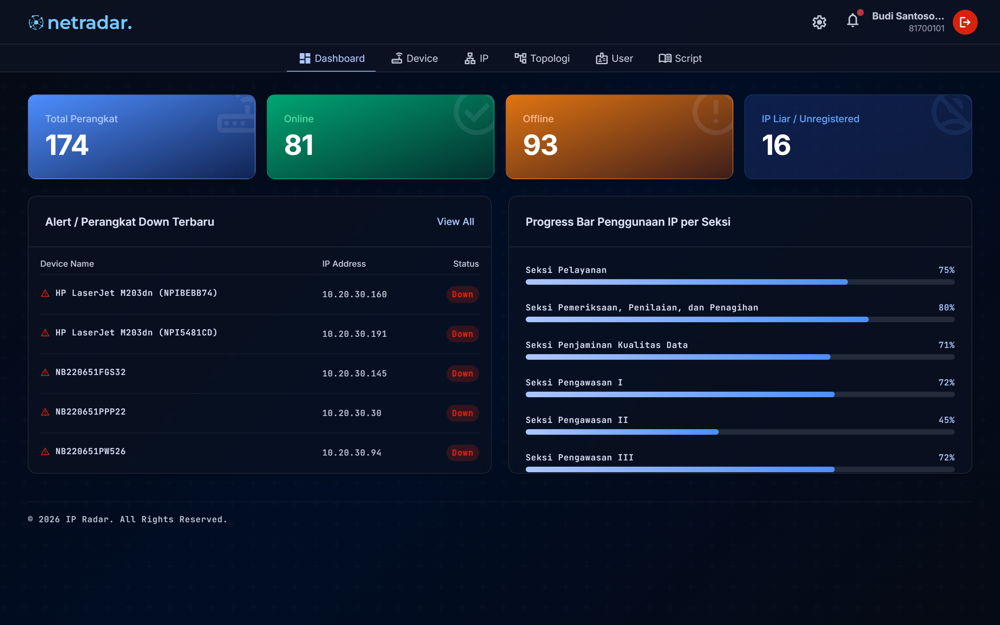
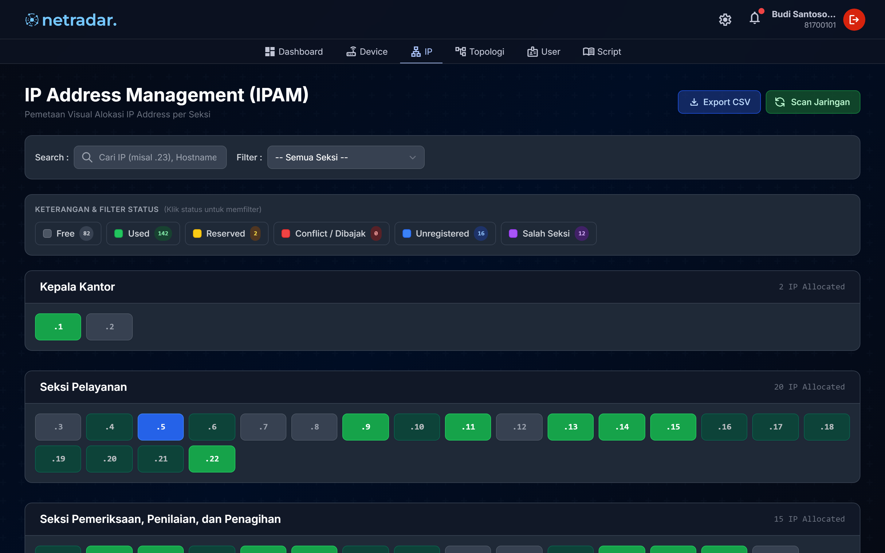
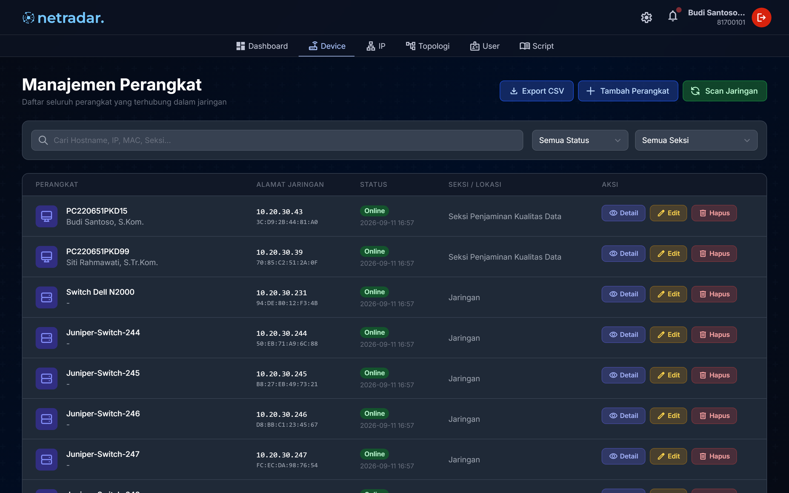
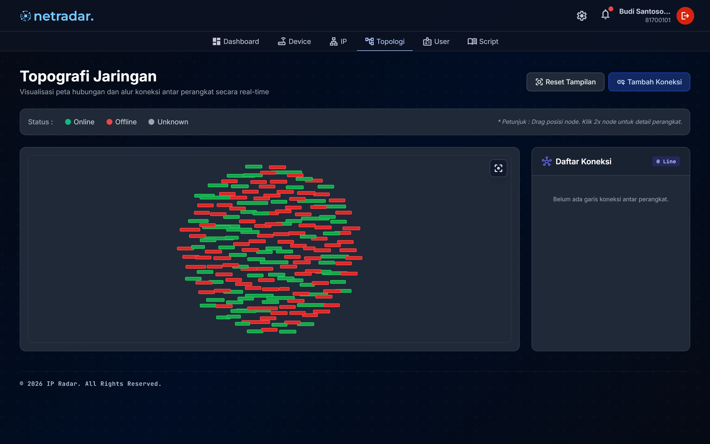
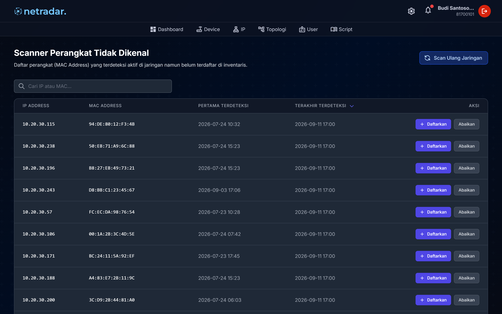
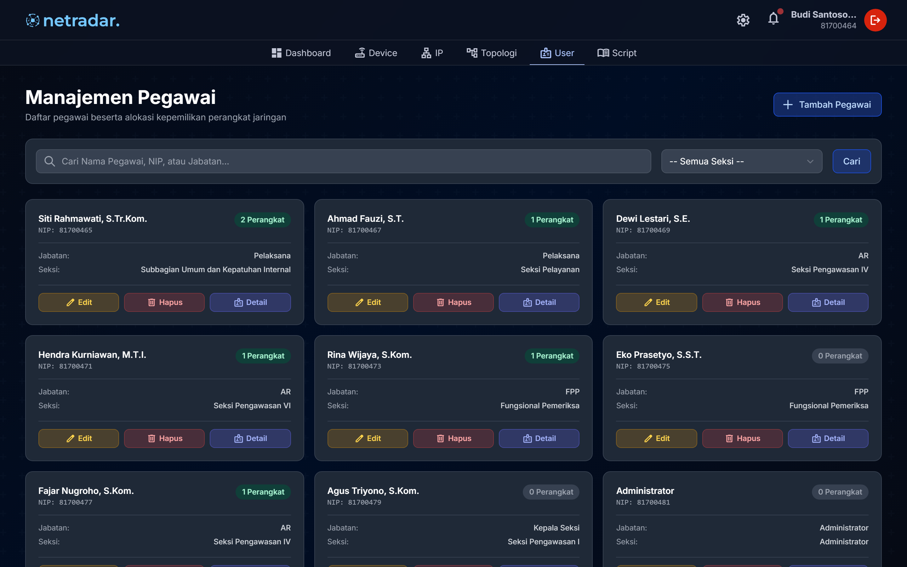
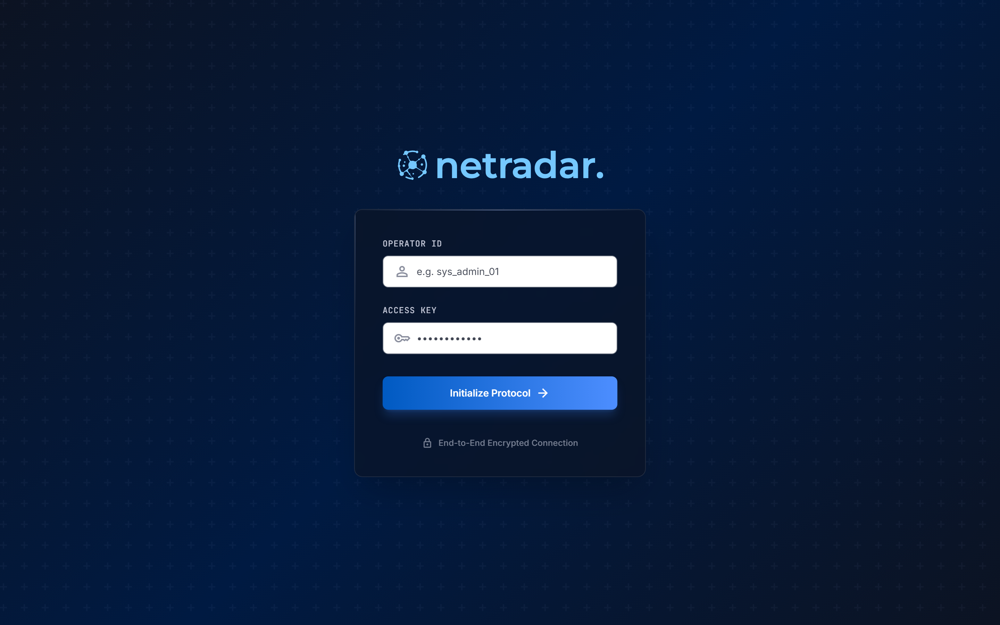
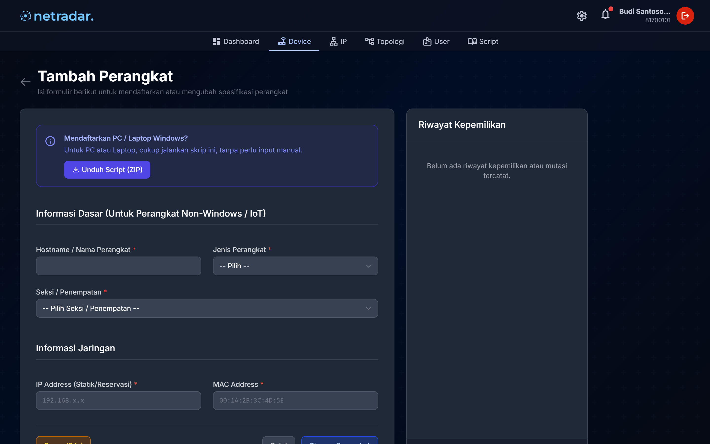
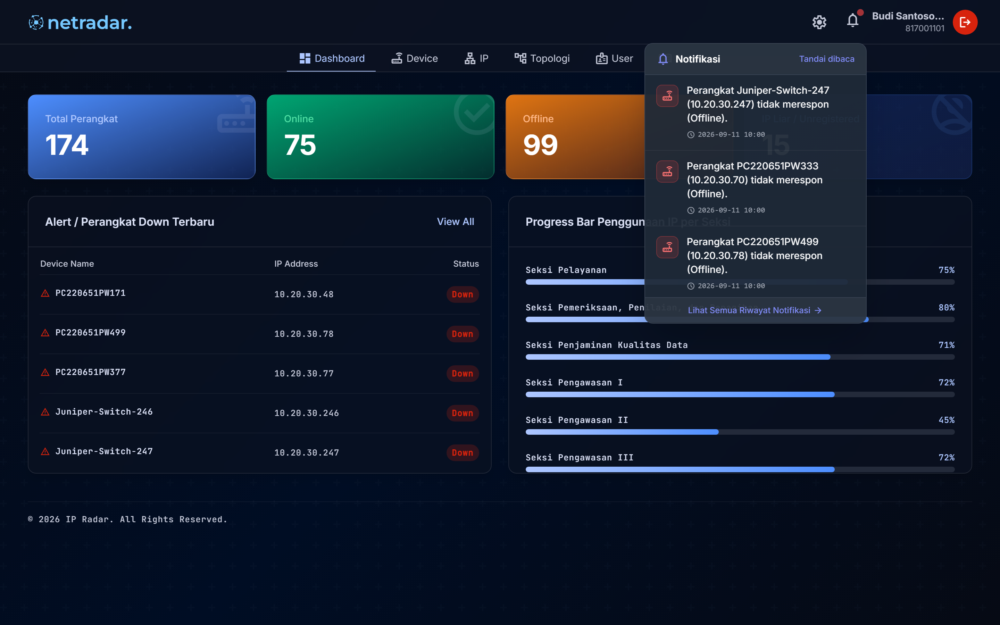

# 🚀 📡 NetRadar — Sistem Manajemen Aset Jaringan & IPAM Terpadu

<p align="center">
  
</p>

<p align="center">
  <strong>Solusi terpusat untuk monitoring konektivitas real-time, visualisasi matriks IPAM bersegmen, audit hardware otomatis via PowerShell WMI, dan pemetaan graf topologi jaringan interaktif.</strong>
</p>

<p align="center">
  <a href="https://fastapi.tiangolo.com/"></a>
  <a href="https://www.python.org/"></a>
  <a href="https://tailwindcss.com/"></a>
  <a href="https://www.mysql.com/"></a>
  <a href="https://www.docker.com/"></a>
  <a href="LICENSE"></a>
  
  
</p>

---

## 📑 Daftar Isi (Table of Contents)

- [📌 Tentang NetRadar](#-tentang-netradar)
- [📸 Screenshot Tampilan Aplikasi](#-screenshot-tampilan-aplikasi)
- [✨ Fitur Unggulan](#-fitur-unggulan)
  - [1. Manajemen Alokasi & IPAM Terstruktur](#1-manajemen-alokasi--ipam-terstruktur)
  - [2. Pemantauan Real-Time & Rogue Device Scanner](#2-pemantauan-real-time--rogue-device-scanner)
  - [3. Inventaris Aset Digital & Audit Hardware Otomatis](#3-inventaris-aset-digital--audit-hardware-otomatis)
  - [4. Pemetaan Graf Topologi Jaringan Interaktif](#4-pemetaan-graf-topologi-jaringan-interaktif)
- [🛠️ Tabel Tech Stack](#️-tabel-tech-stack)
- [🔑 Kredensial Default & Sistem Autentikasi](#-kredensial-default--sistem-autentikasi)
- [🏁 Panduan Instalasi & Menjalankan Proyek](#-panduan-instalasi--menjalankan-proyek)
- [🧪 Panduan Pengujian (Testing Guide)](#-panduan-pengujian-testing-guide)
- [🔒 Praktik Keamanan Terbaik (Security Best Practices)](#-praktik-keamanan-terbaik-security-best-practices)
- [☁️ Panduan Deployment](#️-panduan-deployment)
- [🗄️ Struktur Direktori Proyek](#️-struktur-direktori-proyek)
- [🗺️ Roadmap Pengembangan](#️-roadmap-pengembangan)
- [🤝 Panduan Kontribusi (Contributing)](#-panduan-kontribusi-contributing)
- [💬 Kontak & Dukungan](#-kontak--dukungan)
- [💖 Dukungan Sponsor (Sponsorship)](#-dukungan-sponsor-sponsorship)
- [📜 Lisensi](#-lisensi)

---

## 📌 Tentang NetRadar

**NetRadar** adalah ekosistem aplikasi berbasis web yang dirancang sebagai *single source of truth* (sumber data tunggal terpadu) untuk tata kelola infrastruktur jaringan intranet, alokasi alamat IP (*IP Address Management*), dan inventarisasi aset digital di lingkungan perkantoran atau instansi pemerintah.

### Masalah yang Diselesaikan:
- ❌ **Alokasi IP Tersebar Acak**: Penetapan alamat IP sebelumnya dilakukan tanpa segmentasi subnet yang jelas per divisi/seksi, memicu seringnya terjadi insiden konflik IP (*IP conflict*) yang memutus koneksi kerja pengguna.
- ❌ **Ketiadaan Data Kepemilikan Aset**: Alamat fisik (MAC Address) perangkat tidak terhubung dengan identitas pegawai penanggung jawab secara terpusat, menyulitkan pelacakan aset saat terjadi mutasi pegawai.
- ❌ **Pemindaian Manual & Lambat**: Tim TI harus bergantung pada pemindaian manual sesekali via tools desktop pihak ketiga, sehingga perangkat asing (*rogue/unknown devices*) lambat teridentifikasi.
- ❌ **Audit Spesifikasi Komputer Memakan Waktu**: Pemeriksaan spesifikasi jeroan komputer dinas (CPU, RAM, kapasitas storage SSD/HDD) harus dilakukan secara manual dari meja ke meja.

### Solusi yang Diberikan:
- ✅ **Matriks Grid IPAM Bersegmen**: Visualisasi matriks status IP intuitif dengan validasi kuota subnet ketat per seksi serta fitur reservasi alokasi.
- ✅ **Pemantauan Otomatis & Live SSE**: Mesin pemindai *asynchronous* berbasis ICMP/ARP yang berjalan 24/7 di latar belakang dan menyiarkan perubahan status secara *real-time* tanpa perlu reload halaman.
- ✅ **Audit Hardware Semi-Otomatis**: Ekstraksi spesifikasi hardware klien secara otomatis melalui skrip PowerShell WMI yang ringan tanpa instalasi aplikasi agen berat.
- ✅ **Topologi Visual Interaktif**: Pemetaan relasi fisik antar-perangkat jaringan (Gateway, Core Switch, Access Switch, hingga Client) berbasis graf dinamis dengan interaksi *drag-and-drop*.

---

## 📸 Screenshot Tampilan Aplikasi

Berikut adalah dokumentasi tampilan antarmuka nyata dari sistem **NetRadar**:

<!-- FORMAT TABEL 2 KOLOM (Dashboard & IPAM Grid) -->
| 📊 Dashboard Utama & Metrik Real-Time | 🌐 Manajemen Alokasi IPAM Grid |
| :---: | :---: |
|  |  |
| *Statistik status perangkat, distribusi tipe, progress bar IP per seksi, & quick alerts.* | *Visualisasi status IP per seksi (Used, Free, Reserved, Conflict) dengan modal inspeksi detail.* |

<br />

<!-- FORMAT TABEL 2 KOLOM (Perangkat & Topologi) -->
| 💻 Inventaris Perangkat & Status Koneksi | 🗺️ Graf Topologi Jaringan Interaktif |
| :---: | :---: |
|  |  |
| *Manajemen aset digital, filter seksi & status, serta ekspor/impor spreadsheet massal.* | *Pemetaan jalur interkoneksi vis-network dengan indikator status warna & drag-and-drop layout.* |

<br />

<!-- FORMAT TABEL 2 KOLOM (Rogue Scanner & Pegawai) -->
| 📡 Radar Perangkat Asing (Rogue Scanner) | 👥 Profil & Inventaris Aset Pegawai |
| :---: | :---: |
|  |  |
| *Deteksi otomatis perangkat tak dikenal pada intranet dengan opsi registrasi kilat.* | *Katalog kartu pegawai dengan rekapitulasi perangkat yang sedang digunakan per individu.* |

<br />

<!-- FORMAT TABEL 3 KOLOM (Modal & Detail Aksi) -->
| 🔐 Form Login Modern | ⚙️ Form Pendaftaran & Reservasi IP | 🔔 Bilah Notifikasi Terpadu |
| :---: | :---: | :---: |
|  |  |  |
| *Autentikasi NIP Pendek & password hash.* | *Pilihan pemilik pegawai & validasi alokasi subnet.* | *Peringatan real-time saat perangkat offline.* |

---

## ✨ Fitur Unggulan

### 1. Manajemen Alokasi & IPAM Terstruktur
- **Visualisasi Matriks Grid Berwarna**: Status setiap IP disajikan dalam kode warna instan:
  - 🟢 **Free (Tersedia)**: Alamat IP kosong siap pakai.
  - 🔴 **Used (Digunakan)**: Sedang digunakan oleh perangkat terdaftar.
  - 🟡 **Reserved (Direservasi)**: Telah dipesan khusus untuk kebutuhan perangkat mendatang.
  - 🟠 **Conflict (Konflik)**: Terdeteksi duplikasi alokasi IP pada beberapa perangkat.
- **Validasi Kuota Subnet Ketat**: Sistem otomatis memvalidasi apakah IP yang diinput berada di dalam subnet seksi penanggung jawab perangkat, mencegah salah alokasi.
- **Reservasi IP Mandiri**: Memungkinkan admin memesan alamat IP sebelum perangkat fisik dipasang.
- **Ekspor Rekapitulasi Excel**: Unduh lembar kerja alokasi IP terformat rapi (`.xlsx`) dalam satu klik.

### 2. Pemantauan Real-Time & Rogue Device Scanner
- **Mesin Pemindaian Asynchronous**: Memanfaatkan `APScheduler` dan `icmplib` untuk mengeksekusi ping paralel non-blocking ke seluruh perangkat setiap 3 menit tanpa membebani bandwidth intranet.
- **Deteksi Perangkat Asing (Unknown/Rogue)**: Mengidentifikasi perangkat baru yang aktif di segmen jaringan lokal namun belum tercatat di database inventaris.
- **Live Streaming SSE (Server-Sent Events)**: Pembaruan status (Online/Offline) dan alert disiarkan secara langsung ke antarmuka pengguna tanpa perlu refresh halaman.

### 3. Inventaris Aset Digital & Audit Hardware Otomatis
- **Audit Otomatis via PowerShell WMI**: Menyediakan skrip otomasi klien (`IPRadar_Installer.ps1`) untuk membaca spesifikasi perangkat keras (Merk & Model CPU, Kapasitas RAM, Tipe Penyimpanan SSD/HDD, Versi OS, hingga Alamat Fisik/MAC) dan mendaftarkannya ke server secara otomatis.
- **Riwayat Mutasi & Kepemilikan (Audit Trail)**: Mencatat rekam jejak historis perpindahan pemegang inventaris saat terjadi mutasi pegawai.
- **Impor & Ekspor Massal**: Kemudahan migrasi data awal aset perangkat melalui berkas spreadsheet.

### 4. Pemetaan Graf Topologi Jaringan Interaktif
- **Visualisasi Arsitektur Dinamis**: Dibangun di atas pustaka *vis-network* untuk memetakan alur relasi: Gateway Utama $\rightarrow$ Core Switch $\rightarrow$ Access Switch $\rightarrow$ Perangkat Klien.
- **Interaksi Drag-and-Drop dengan Penyimpanan Koordinat**: Posisi penataan node disimpan otomatis ke basis data sehingga tata letak diagram selalu konsisten saat dibuka kembali.
- **Modal Relasi Cepat**: Fasilitas intuitif untuk menambah atau menghapus relasi kabel/koneksi antar node.

---

## 🛠️ Tabel Tech Stack

| Layer Arsitektur | Teknologi / Library | Versi | Peran & Alasan Penggunaan |
| :--- | :--- | :--- | :--- |
| **Backend Framework** | [FastAPI](https://fastapi.tiangolo.com/) | `^0.100.0` | Framework web ASGI modern dengan performa tinggi, concurrency native, dan otomatisasi dokumentasi OpenAPI |
| **Bahasa Pemrograman** | [Python](https://www.python.org/) | `^3.11` | Bahasa utama untuk logika backend, eksekusi coroutine async, dan integrasi library jaringan |
| **Database & ORM** | [SQLAlchemy](https://www.sqlalchemy.org/) | `^2.0.0` | Object Relational Mapper untuk relasi kompleks, transactional safety, dan connection pooling |
| **Database Migration** | [Alembic](https://alembic.sqlalchemy.org/) | `^1.12.0` | Manajemen migrasi skema tabel basis data yang terstruktur dan terlacak versinya |
| **Frontend Templating** | [Jinja2](https://jinja.palletsprojects.com/) | `^3.1.2` | Server-Side Rendering (SSR) yang cepat, modular, dan terisolasi |
| **Styling & Design System** | [Tailwind CSS](https://tailwindcss.com/) | `^3.3.0` | Utilitas CSS modern untuk desain dashboard yang responsif, rapi, dan konsisten |
| **Graf Topologi Jaringan** | [vis-network](https://visjs.github.io/vis-network/) | `^9.1.2` | Rendering visual diagram graf interaktif berbasis canvas HTML5 dengan simulasi fisika |
| **Network Scanner** | [icmplib](https://github.com/Val-Jean/icmplib) | `^3.0.4` | Modul ping ICMP sockets non-blocking asinkron berperforma tinggi |
| **Task Scheduler** | [APScheduler](https://apscheduler.readthedocs.io/) | `^3.10.4` | Pengelola eksekusi pemindaian periodik di latar belakang secara otomatis |
| **Klien Telemetri** | PowerShell Core WMI | Windows Native | Skrip audit otomatis spesifikasi hardware tanpa instalasi runtime berat di klien |
| **Basis Data** | MySQL / MariaDB | `>= 8.0` | Penyimpanan basis data relasional yang andal dengan dukungan PyMySQL driver |
| **Kontainerisasi** | [Docker](https://www.docker.com/) & Docker Compose | `>= 24.0` | Pengemasan lingkungan aplikasi yang terisolasi dan konsisten untuk produksi |

---

## 🔑 Kredensial Default & Sistem Autentikasi

NetRadar menerapkan otentikasi sesi cookie berbasis peran (**Role-Based Access Control / RBAC**):

| Role Pengguna | Kredensial Demo (Username / Password) | Hak Akses Sistem |
| :--- | :--- | :--- |
| **Administrator** | Username: `admin` <br /> Password: `admin` | **Akses Penuh (Full CRUD)**: Manajemen perangkat, konfigurasi alokasi IP pool, pemicu pemindaian manual, pengaturan seksi, dan manipulasi topologi. |
| **Viewer** | Username: `viewer` <br /> Password: `viewer` | **Mode Peninjauan (Read-Only)**: Hanya dapat melihat metrik dashboard, ketersediaan IPAM, dan topologi jaringan tanpa tombol aksi manipulasi data. |

> [!TIP]
> Jalankan perintah `python scripts/seed_dummy.py` untuk menginisialisasi akun demo di atas serta ~50 data perangkat sintetis untuk keperluan pengujian lokal.

---

## 🏁 Panduan Instalasi & Menjalankan Proyek

Ikuti petunjuk langkah demi langkah berikut untuk menjalankan **NetRadar** di komputer lokal Anda:

### 1️⃣ Prasyarat Sistem
Pastikan lingkungan Anda telah terpasang:
- **Python**: Versi `3.11` atau lebih baru ([Unduh Python](https://www.python.org/downloads/))
- **MySQL Server** atau **MariaDB**: Versi `8.0+` (misal via Laragon, XAMPP, atau Docker)
- **Git**: Untuk clone repositori
- **Docker & Docker Compose** *(Opsional, direkomendasikan untuk deployment produksi)*

Periksa versi di terminal:
```bash
python --version
pip --version
git --version
```

### 2️⃣ Clone Repositori
Unduh kode sumber ke direktori lokal Anda:
```bash
git clone https://github.com/dhafinfuad/netradar.git
cd netradar
```

### 3️⃣ Buat & Aktifkan Virtual Environment
```bash
python -m venv .venv

# Untuk Windows (PowerShell / Command Prompt):
.venv\Scripts\activate

# Untuk Linux / macOS:
source .venv/bin/activate
```

### 4️⃣ Pasang Dependensi Proyek
```bash
pip install -r requirements.txt
```

### 5️⃣ Konfigurasi Environment Variables
Salin template berkas konfigurasi lingkungan:
```bash
cp .env.example .env
```
Buka file `.env` dan sesuaikan parameter koneksi basis data Anda:
```env
DATABASE_URL=mysql+pymysql://root:@localhost:3306/db_aplikasi
SECRET_KEY=ganti_dengan_kunci_rahasia_acak_yang_aman
SCRIPT_API_TOKEN=token_script_ipradar_2026
PING_INTERVAL_MINUTES=3
```

### 6️⃣ Jalankan Migrasi Basis Data
Terapkan seluruh skema tabel aplikasi ke basis data menggunakan Alembic:
```bash
alembic upgrade head
```

### 7️⃣ Inisialisasi Data Dummy (Opsional untuk Pengujian)
```bash
python scripts/seed_dummy.py
```

### 8️⃣ Jalankan Server Pengembangan (Dev Mode)
```bash
uvicorn main:app --reload --host 0.0.0.0 --port 8000
```
Setelah aktif, buka peramban web dan navigasikan ke:
```text
http://localhost:8000
```

---

## 🧪 Panduan Pengujian (Testing Guide)

Kami menjaga stabilitas dan kualitas kode melalui validasi berjenjang:

### Pemeriksaan Integritas Skema Database
Pastikan seluruh migrasi model SQLAlchemy telah sinkron dengan struktur database:
```bash
alembic current
alembic check
```

### Pengujian Kompilasi Kode Python
Validasi sintaksis seluruh modul Python sebelum proses deployment:
```bash
python -m compileall .
```

### Pengujian Endpoint & Autentikasi
Gunakan FastAPI TestClient untuk pengujian request API:
```bash
python -m unittest discover -s tests -p "test_*.py"
```

---

## 🔒 Praktik Keamanan Terbaik (Security Best Practices)

- 🛡️ **Perlindungan Kredensial via `.gitignore`**: Berkas rahasia `.env`, kunci SSH, serta konfigurasi server lokal dilindungi secara ketat agar tidak pernah ter-commit ke repositori publik.
- 🔑 **Proteksi Sesi Berbasis Token & RBAC**: Endpoint sensitif diproteksi dependensi `require_admin` untuk menjamin hanya pengguna dengan hak akses resmi yang dapat mengubah data inventaris.
- 🧼 **Sanitasi Masukan & Parameterized Queries**: Seluruh query database dieksekusi melalui SQLAlchemy ORM guna mencegah celah keamanan SQL Injection.
- 📦 **Injeksi Token Agen Dinamis**: Skrip klien PowerShell diunduh melalui endpoint terenkripsi yang secara dinamis menyuntikkan token otorisasi tanpa mengekspos token statis di berkas publik.

---

## ☁️ Panduan Deployment

### Menjalankan dengan Docker Compose (Direkomendasikan)

Untuk mendeteksi alamat fisik (MAC Address) perangkat pada subnet intranet lokal secara optimal, kontainer dijalankan dengan mode jaringan host (`network_mode: "host"`):

```bash
docker compose up -d --build
```

Lihat log container yang sedang berjalan:
```bash
docker compose logs -f
```

Hentikan container:
```bash
docker compose down
```

### Environment Variables Wajib di Produksi:
Pastikan variabel berikut diset dengan nilai yang kuat dan aman di server produksi:
- `DATABASE_URL`: URI koneksi MySQL produksi (disarankan menggunakan user khusus dengan batasan hak akses).
- `SECRET_KEY`: String acak kriptografis 64-karakter untuk menandatangani sesi cookie.
- `SCRIPT_API_TOKEN`: Kunci otorisasi khusus untuk payload pengiriman data dari skrip agen klien.
- `PING_INTERVAL_MINUTES`: Interval jadwal ping otomatis (default: `3` menit).

---

## 🗄️ Struktur Direktori Proyek

```text
netradar/
├── 📁 alembic/                 # Skrip migrasi schema basis data (Alembic)
│   └── 📁 versions/            # Riwayat berkas migrasi versi tabel
├── 📁 models/                  # Definisi SQLAlchemy ORM models (Device, IPPool, User, dll.)
├── 📁 portfolio_screenshots/   # Koleksi tangkapan layar antarmuka sistem
├── 📁 routers/                 # Endpoint controller FastAPI (Auth, IPAM, Devices, Scanner, dll.)
│   └── 📁 api/                 # Endpoint telemetry & status
├── 📁 scripts/                 # Utilitas database seeder & script pembantu
├── 📁 services/                # Logika bisnis (ICMP Ping Service, SNMP, Autentikasi)
├── 📁 static/                  # Aset statis front-end
│   ├── 📁 downloads/           # Berkas paket installer Windows agent (.zip)
│   ├── 📁 fonts/               # Font ikon lokal (Material Symbols)
│   ├── 📁 icons/               # Logo dan favicon NetRadar (SVG)
│   ├── 📁 js/                  # Konfigurasi Tailwind CSS
│   └── 📁 scripts/             # PowerShell Client Collector script
├── 📁 templates/               # Server-Side Rendering template Jinja2
│   ├── 📁 auth/                # Halaman login
│   ├── 📁 components/          # Komponen UI modular (Navbar, Modal, Button)
│   ├── 📁 dashboard/           # Tampilan metrik utama sistem
│   ├── 📁 devices/             # Modul inventaris perangkat
│   ├── 📁 employees/           # Modul kepemilikan pegawai
│   ├── 📁 ipam/                # Matriks grid alokasi IP Address
│   ├── 📁 scanner/             # Radar pemindai perangkat asing
│   ├── 📁 settings/            # Pengaturan parameter jaringan & seksi
│   └── 📁 topology/            # Visualisasi graf topologi jaringan
├── 📄 .env.example             # Template konfigurasi variabel lingkungan publik
├── 📄 .gitignore               # Berkas yang dikecualikan dari pelacakan Git
├── 📄 alembic.ini              # Konfigurasi engine migrasi Alembic
├── 📄 config.py                # Pemuat variabel environment sistem
├── 📄 database.py              # Koneksi engine & session pooling SQLAlchemy
├── 📄 dependencies.py          # FastApi dependencies & proteksi RBAC
├── 📄 Dockerfile               # Spesifikasi kontainerisasi aplikasi
├── 📄 docker-compose.yml       # Konfigurasi orkestrasi kontainer Docker
├── 📄 main.py                  # Titik masuk utama aplikasi (FastAPI entrypoint)
├── 📄 requirements.txt         # Daftar pustaka dependensi Python
├── 📄 utils.py                 # Utilitas pembantu & fungsi format
└── 📄 README.md                # Dokumentasi utama proyek
```

---

## 🗺️ Roadmap Pengembangan

- [x] **v0.5.0**: Fondasi arsitektur FastAPI, skema database, migrasi Alembic, dan autentikasi RBAC.
- [x] **v1.0.0**: Rilis stabil perdana:
  - [x] Visualisasi matriks IPAM Grid dengan validasi batas subnet.
  - [x] Background ping scanner asinkron & live update status via Server-Sent Events (SSE).
  - [x] Otomasi ekstraksi spesifikasi hardware via PowerShell WMI.
  - [x] Pemetaan topologi jaringan interaktif berbasis vis-network (drag-and-drop layout).
- [ ] **v1.1.0**:
  - [ ] Ekspor laporan audit inventaris hardware berkala ke format dokumen PDF.
  - [ ] Integrasi webhook notifikasi instan ke Telegram Bot saat perangkat kritis offline.
- [ ] **v2.0.0**:
  - [ ] Deteksi port switch otomatis via protokol LLDP / CDP via SNMP v3.
  - [ ] Multi-subnet auto scanner untuk jaringan enterprise dengan banyak VLAN.

---

## 🤝 Panduan Kontribusi (Contributing)

Kontribusi untuk perbaikan bug dan peningkatan fitur selalu disambut dengan hangat! Ikuti langkah standar berikut:

1. **Fork** repositori ini ke akun GitHub Anda.
2. Buat branch fitur baru:
   ```bash
   git checkout -b fitur/nama-fitur-keren
   ```
3. Lakukan perubahan kode dan pastikan uji kompilasi berhasil:
   ```bash
   python -m compileall .
   ```
4. Buat commit perubahan Anda:
   ```bash
   git commit -m "feat: tambahkan fitur baru yang keren"
   ```
5. Unggah branch ke akun GitHub fork Anda:
   ```bash
   git push origin fitur/nama-fitur-keren
   ```
6. Buka **Pull Request** baru di GitHub dan jelaskan rangkuman perubahannya secara detail.

---

## 💬 Kontak & Dukungan

Jika Anda memiliki pertanyaan, saran fitur, atau menemukan kendala teknis:

- 🐛 **Laporkan Isu / Bug**: [GitHub Issues](https://github.com/dhafinfuad/netradar/issues)
- 💡 **Ruang Diskusi**: [GitHub Discussions](https://github.com/dhafinfuad/netradar/discussions)
- 📧 **Kontak Profil**: Hubungi melalui profil GitHub [@dhafinfuad](https://github.com/dhafinfuad)

---

## 💖 Dukungan Sponsor (Sponsorship)

Jika proyek **NetRadar** bermanfaat bagi pekerjaan, tim, atau studi Anda:

- ⭐ **Berikan Bintang (Star)** pada repositori ini di GitHub!
- 📢 Bagikan proyek ini kepada rekan kerja atau komunitas pegiat jaringan & sistem administrator.
- ☕ Dukung pengembang melalui tautan donasi di profil GitHub [@dhafinfuad](https://github.com/dhafinfuad).

---

## 📜 Lisensi

Proyek ini dilisensikan di bawah lisensi **MIT License** — silakan gunakan, pelajari, dan kembangkan secara bebas dengan tetap menyertakan atribusi hak cipta aslinya.

<p align="center">
  Dibuat dengan ❤️ oleh <a href="https://github.com/dhafinfuad">@dhafinfuad</a>
</p>
